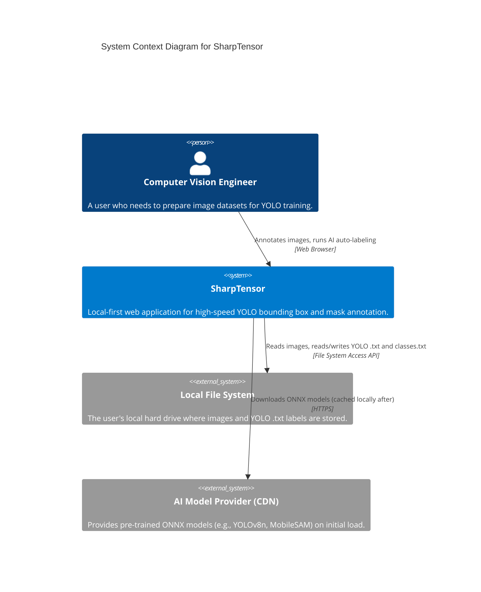
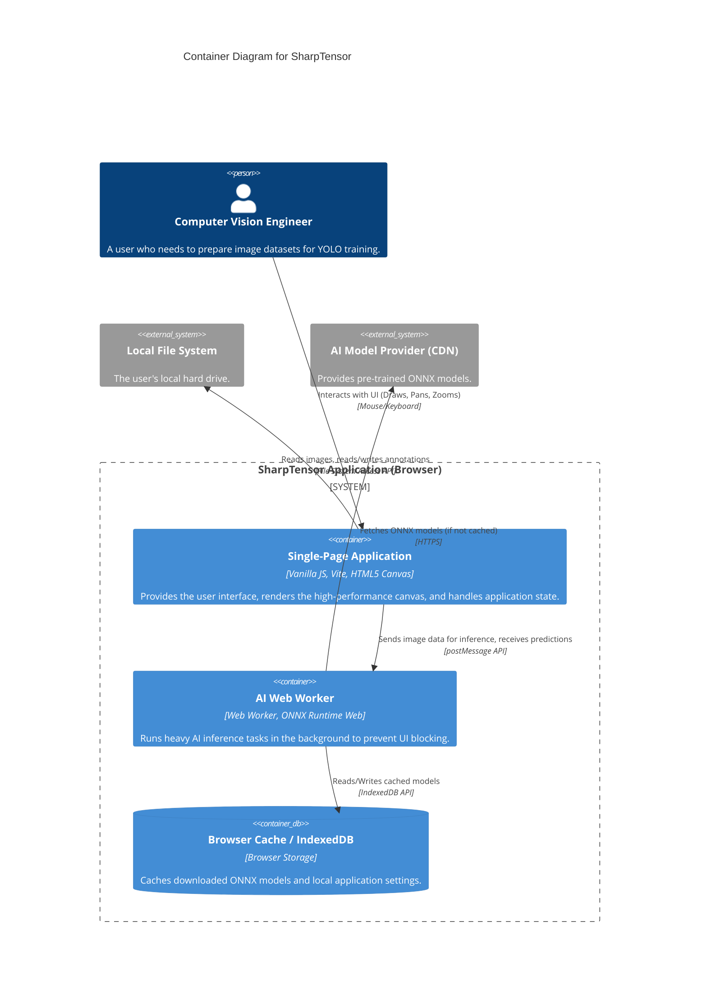
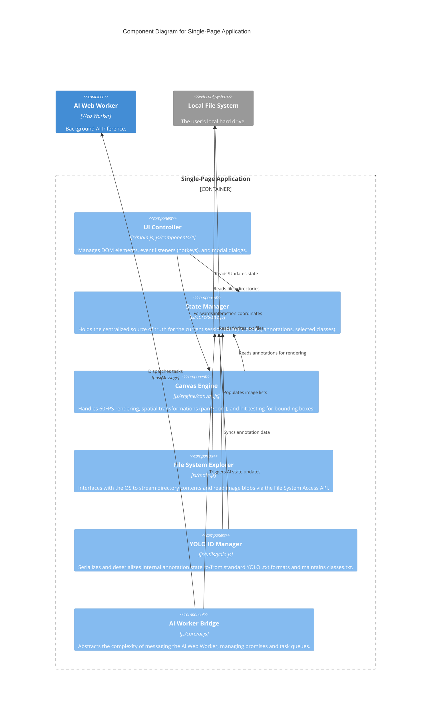
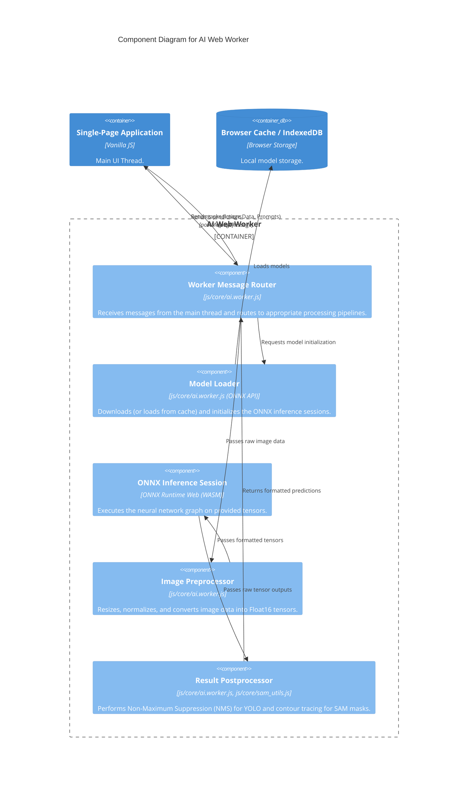

# SharpTensor Architecture (C4 Model)

This document provides an architectural overview of the SharpTensor application using the [C4 model for visualizing software architecture](https://c4model.com/). 

## Level 1: System Context Diagram

The System Context diagram provides a high-level overview of SharpTensor, showing how the system fits into the world around it and how it interacts with external entities.

---

## Level 2: Container Diagram

The Container diagram zooms into the SharpTensor system to show the high-level technical building blocks.

---

## Level 3: Component Diagrams

The Component diagrams zoom into individual containers to show their internal structure.

### 3.1 Components: Single-Page Application (Main UI Thread)

### 3.2 Components: AI Web Worker

