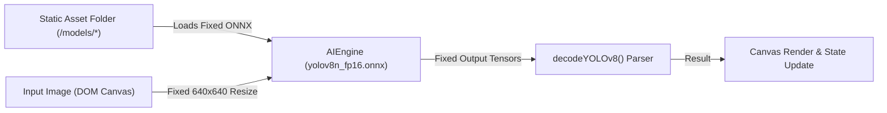
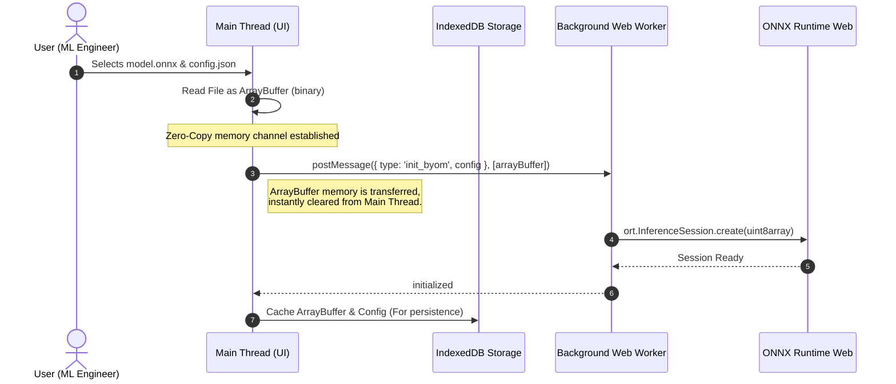
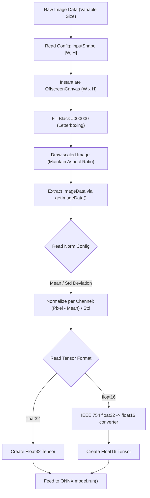
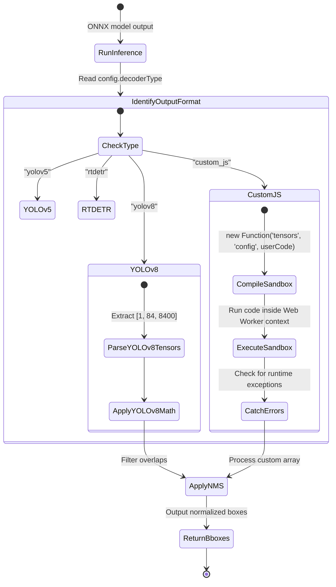
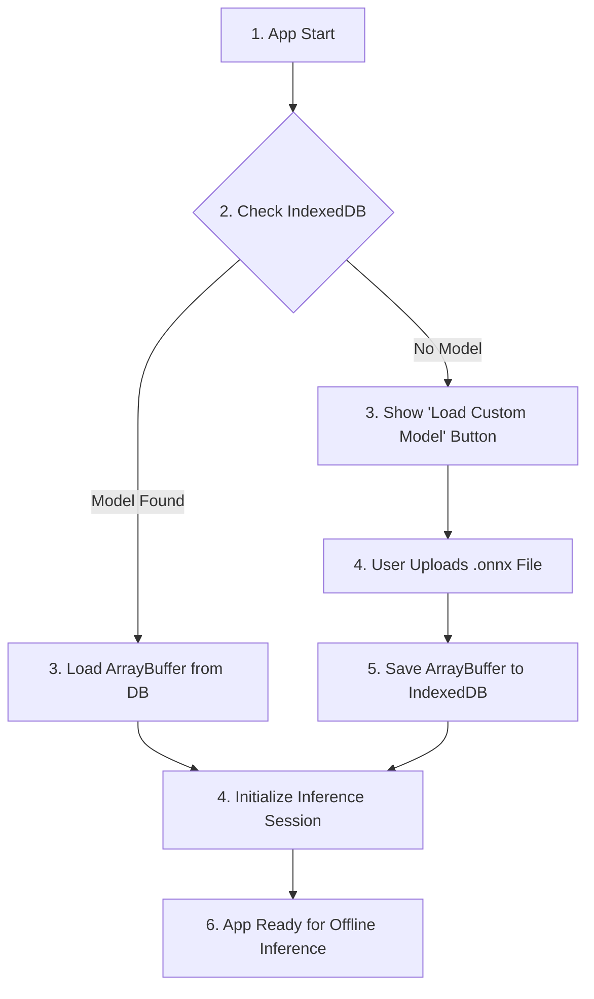
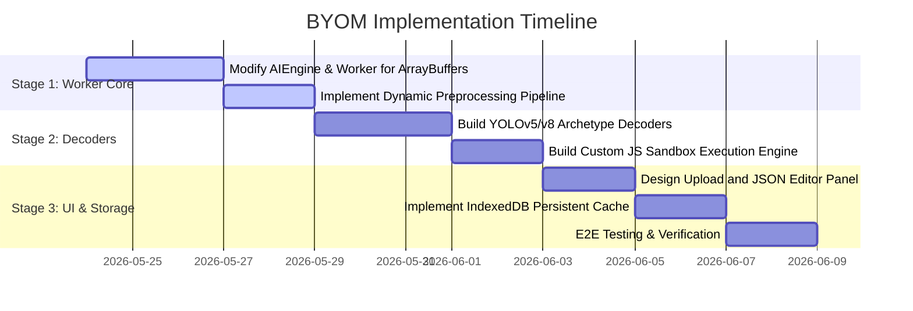
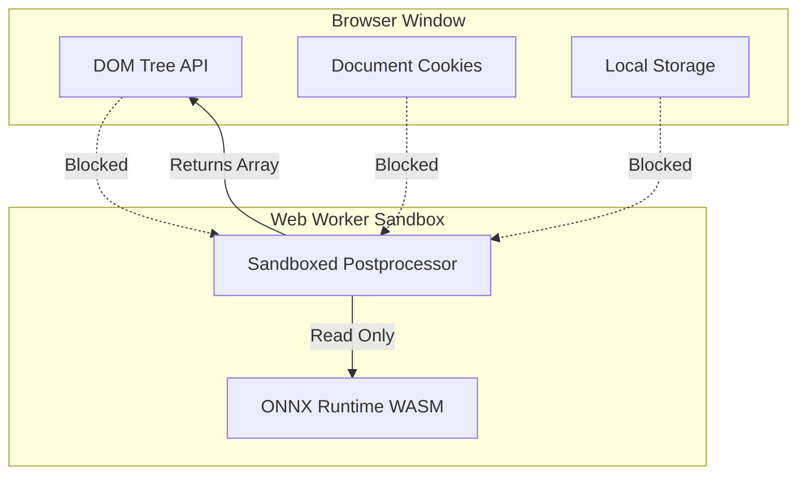

# Detailed Feasibility Study: Bring Your Own Model (BYOM) in SharpTensor

This document provides a highly detailed architectural analysis and implementation blueprint for integrating custom ONNX models (BYOM) into SharpTensor. Designed for visual comprehension, this study diagrams every component of the client-side, local-first ML pipeline.

---

## 1. Architectural Overview: Current vs. Proposed

Currently, SharpTensor relies on static paths and hardcoded model parameters. The proposed BYOM model introduces a runtime configuration layer that dynamically adapts preprocessing and postprocessing logic based on model metadata.

### Current Static Pipeline


### Proposed BYOM Pipeline

```mermaid
flowchart TD
    UserONNX["Custom Model File (.onnx)"] -->|1. File Upload / IndexedDB| Main["Main Thread (App UI)"]
    UserJSON["Model Config (JSON)"] -->|2. Configuration Schema| Main
    Main -->|3. Transferable ArrayBuffer & Config| Worker["Web Worker (ai.worker.ts)"]
    
    SubGraph1["Worker Inference Pipeline"]
    Image["Input Image Data"] -->|4. Dynamic Preprocess| OffscreenCanvas["OffscreenCanvas (Dynamic Resize/Norm)"]
    OffscreenCanvas -->|5. Float32/Float16 Tensor| SessionRun["ort.InferenceSession.run()"]
    SessionRun -->|6. Raw Output Tensors| DynamicDecoder{"Decoder Dispatcher"}
    
    DynamicDecoder -->|Type: YOLOv5/v8/RT-DETR| Preset["Preset Decode Engine"]
    DynamicDecoder -->|Type: Custom JS| Sandbox["Sandboxed Eval Runtime"]
    
    Preset -->|7. BoundingBoxes Array| OutMsg["Worker postMessage()"]
    Sandbox -->|7. BoundingBoxes Array| OutMsg
    
    OutMsg -->|8. Transfer Result| Main
    Main -->|9. Redraw Canvas| UI["Updated Bounding Boxes UI"]

    style SubGraph1 fill:#1e1e2e,stroke:#313244,stroke-width:2px;
```


---

## 2. Deep Dive: Memory-Safe Model Transfer (Transferable Objects)
Loading files up to 200MB in the browser can freeze the UI thread. The BYOM architecture mitigates this by bypassing the standard structured clone algorithm using **Transferable Objects**.



---

## 3. Preprocessing Engine: Dynamic Offscreen Canvas
Different models require varying dimensions, color normalization factors, and normalization styles. Below is the proposed dynamic preprocessing pipeline mapping any image file input to a runtime-defined model input tensor.



---

## 4. The Extensible Decoder: Archetypes & JS Sandboxing
Once the model runs, the raw tensors must be converted to structured coordinates (`BoundingBox[]`).



### JSON Configuration Schema Blueprint
To support this pipeline, users will configure their model using a JSON manifest like the one shown below:

```json
{
  "name": "Custom MobileNet-SSD",
  "task": "detection",
  "input": {
    "name": "input_tensor",
    "shape": [1, 3, 300, 300],
    "mean": [127.5, 127.5, 127.5],
    "std": [127.5, 127.5, 127.5],
    "format": "float32"
  },
  "decoder": {
    "type": "custom_js",
    "iouThreshold": 0.45,
    "scoreThreshold": 0.5,
    "code": "const boxes = tensors.output_boxes.data;\nconst scores = tensors.output_scores.data;\nconst detections = [];\n// Parse bounding boxes logic...\nreturn detections;"
  }
}
```

---

## 5. Local Persistence Architecture (IndexedDB Cache)
Large models shouldn't be re-uploaded on page reload. The local storage architecture relies on IndexedDB to cache custom `.onnx` binaries and configs.



---

## 6. Implementation Stages & Estimated Effort



---

## 7. Security Architecture of the JS Sandbox
Running user-submitted JavaScript inside the browser poses security risks. However, the Web Worker execution model acts as a natural boundary:



- **Access Restriction**: The Web Worker has no access to the `window` object, the `document` object, DOM elements, cookies, or `localStorage`.
- **Network Isolation**: The sandboxed JS code can run purely arithmetic operations on typed arrays, making it impossible to perform Cross-Site Scripting (XSS) attacks or hijack user session data.
