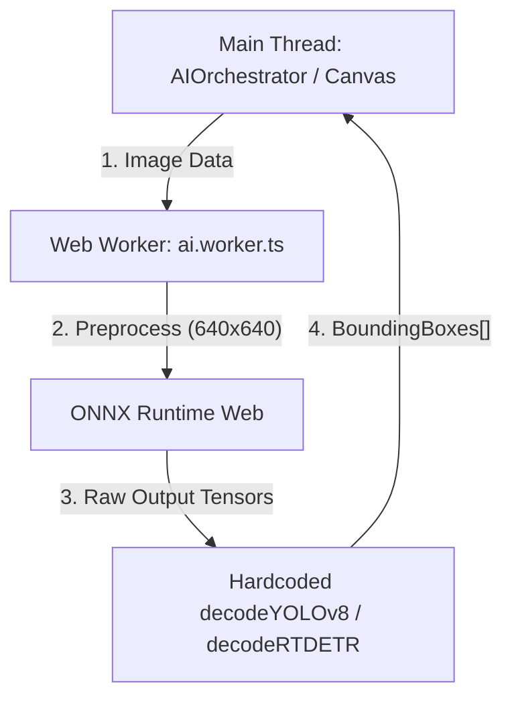

# Feasibility Study: Bring Your Own Model (BYOM) in SharpTensor

## 1. Executive Summary
SharpTensor is a local-first web application designed for high-performance dataset annotation. Currently, it runs a hardcoded AI pipeline using RT-DETR/YOLOv8 for object detection and MobileSAM for segmentation, executing models locally via **ONNX Runtime Web (ORT)** inside a Web Worker.

This feasibility study evaluates the architectural viability of introducing a **Bring Your Own Model (BYOM)** capability. BYOM would enable machine learning engineers to import their own custom-trained object detection models directly into the web browser, eliminating server costs and keeping all training data private (local-first).

We conclude that **implementing BYOM is highly feasible** and aligns perfectly with SharpTensor's client-side runtime model. However, it requires a generic configuration layer for image preprocessing and a flexible decoding interface for model outputs.

---

## 2. Current AI Architecture Analysis
Currently, `AIEngine` (`src/core/ai.ts`) and `ai.worker.ts` handle model execution:



### Limitations for Custom Models
- **Hardcoded URLs**: Models are fetched from static assets (`/models/yolov8n_fp16.onnx`).
- **Hardcoded Preprocessing**: The input tensor is fixed to `1x3x640x640` with specific mean/std normalization and HWC-to-CHW float16 conversion.
- **Hardcoded Postprocessing**: Decoding functions (`decodeYOLOv8` and `decodeRTDETR`) are statically compiled in `ai.worker.ts`. Custom models (e.g. YOLOv5, SSD, EfficientDet) output tensors in different dimensions and styles.

---

## 3. Core Technical Challenges & Solutions

### Challenge 1: Loading Large Local Model Files
Custom ONNX models can range from 10MB to over 200MB. Fetching them via network requests is inefficient for local-first users.
*   **Solution**: Utilize the **HTML5 File API** or the **File System Access API**. The user selects their local `.onnx` file. The main thread reads it into an `ArrayBuffer` and transfers it to the `ai.worker.ts` via `postMessage(..., [arrayBuffer])` as a transferable object, preventing main thread freezes and memory duplication.
*   **ORT Support**: `ort.InferenceSession.create(uint8array)` supports initializing sessions directly from in-memory byte arrays.

### Challenge 2: Dynamic Image Preprocessing
Different architectures require different input dimensions (e.g. 320x320, 640x640, 1024x1024), scaling, and normalization.
*   **Solution**: Introduce a declarative **BYOM Configuration Schema** (JSON format) that describes the expected inputs:
    ```json
    {
      "inputName": "images",
      "inputShape": [1, 3, 640, 640],
      "normalization": {
        "mean": [0, 0, 0],
        "std": [255.0, 255.0, 255.0]
      },
      "format": "float16" 
    }
    ```
    The preprocessing function in `ai.worker.ts` will parse this config and scale/normalize images dynamically on an `OffscreenCanvas`.

### Challenge 3: Output Parsing (Dynamic Decoders)
The output of object detection models is notoriously diverse:
*   *YOLOv8* outputs `[1, 84, 8400]` (84 values: 4 bbox coords + 80 class logits, for 8400 anchors).
*   *YOLOv5* outputs `[1, 25200, 85]` (85 values: 4 bbox coords + 1 objectness score + 80 class logits).
*   *RT-DETR* outputs two separate tensors: `labels` `[1, 300, 80]` and `boxes` `[1, 300, 4]`.
*   *Solution*: Provide a two-pronged decoding strategy:
    1.  **Archetype Presets**: Implement built-in decoders for common layouts (YOLOv5, YOLOv8, YOLOv9/v10, RT-DETR).
    2.  **Custom JS Sandbox Parser**: For truly bespoke models, allow users to supply a short JavaScript code snippet for postprocessing. The worker compiles this snippet at runtime using `new Function()`:
        ```javascript
        // User-supplied decoder logic run in Worker
        const decodeFn = new Function('tensors', 'config', userCodeString);
        const detections = decodeFn(results, config);
        ```

---

## 4. Proposed BYOM Architecture

```
+-------------------------------------------------------------+
|                        USER INTERFACE                       |
|  +---------------------+        +------------------------+  |
|  |   Upload .onnx      |        |   Define JSON Config   |  |
|  +---------------------+        +------------------------+  |
+------------------------------------+------------------------+
                                     |
                Transfer ArrayBuffer | & Config Object
                                     v
+-------------------------------------------------------------+
|                         WEB WORKER                          |
|  +---------------------+        +------------------------+  |
|  |  ORT.createSession  |        | Preprocess (Dynamic)   |  |
|  +----------+----------+        +-----------+------------+  |
|             |                               |               |
|             +------------> RUN <------------+               |
|                             |                               |
|                             v                               |
|                 +-----------+-----------+                   |
|                 |   Postprocess Engine  |                   |
|                 |  +-----------------+  |                   |
|                 |  | Preset Decoders |  |                   |
|                 |  +--------+--------+  |                   |
|                 |           | or        |                   |
|                 |  +--------v--------+  |                   |
|                 |  | Custom JS Eval  |  |                   |
|                 |  +-----------------+  |                   |
|                 +-----------+-----------+                   |
+-----------------------------|-------------------------------+
                              v (Normalized Bounding Boxes)
                      Canvas Redraw
```

---

## 5. Implementation Roadmap & Estimation

### Stage 1: Core Worker Infrastructure (3-4 Days)
- Update `AIEngine.ts` to accept an `ArrayBuffer` instead of a model URL.
- Modify `ai.worker.ts` to instantiate `ort.InferenceSession` from bytes.
- Refactor worker preprocessing logic to use dynamic dimensions, mean, and std values provided in a config payload.

### Stage 2: Extensible Decoding Engine (4-5 Days)
- Implement Preset Decoders (YOLOv5, YOLOv6/v8/v10, RT-DETR) based on configuration flags.
- Implement the sandbox execution context (`new Function()`) in the worker to evaluate custom JS decoders. Provide a structured API for the user script (e.g. access to tensor outputs, sigmoid helpers, and Non-Maximum Suppression (NMS) utilities).

### Stage 3: Settings UI & Preset Registry (3-4 Days)
- Design a premium "Bring Your Own Model" panel in the UI.
- Provide a file input for the `.onnx` model and a text area for the JSON configuration (with pre-built templates for YOLOv8 and YOLOv5).
- Allow local persistence of models using **IndexedDB** (up to several hundred MBs) so users don't have to re-upload their custom models every time they reload the app.

**Total Estimated Effort: 10 - 13 Days (Single Engineer)**

---

## 6. Performance & Security Considerations

### Performance
- **WASM Acceleration**: Custom models will utilize WebAssembly thread pools just like the built-in model, guaranteeing local execution speeds.
- **Float16 Support**: If the custom model uses FP16 weights, ORT Web supports this, but we must ensure the custom JS decoders handle float16 tensor layouts.

### Security
- **Sandboxed JS Execution**: Executing user-provided JS (`new Function`) inside the Web Worker isolates it from the main thread DOM, cookies, and local storage. The worker cannot steal session data or access critical browser cookies.
- **Content Security Policy (CSP)**: Ensure that CSP rules allow loading WASM from third-party CDNs (like JSDelivr for ORT Web binaries) and executing blob-workers.

---

### Conclusion
BYOM is not only feasible, but it represents a **massive competitive differentiator** for SharpTensor compared to server-based web tools like CVAT or Roboflow. It empowers teams to keep their private workflows local-first while fully customizing the models to match their domain needs.
